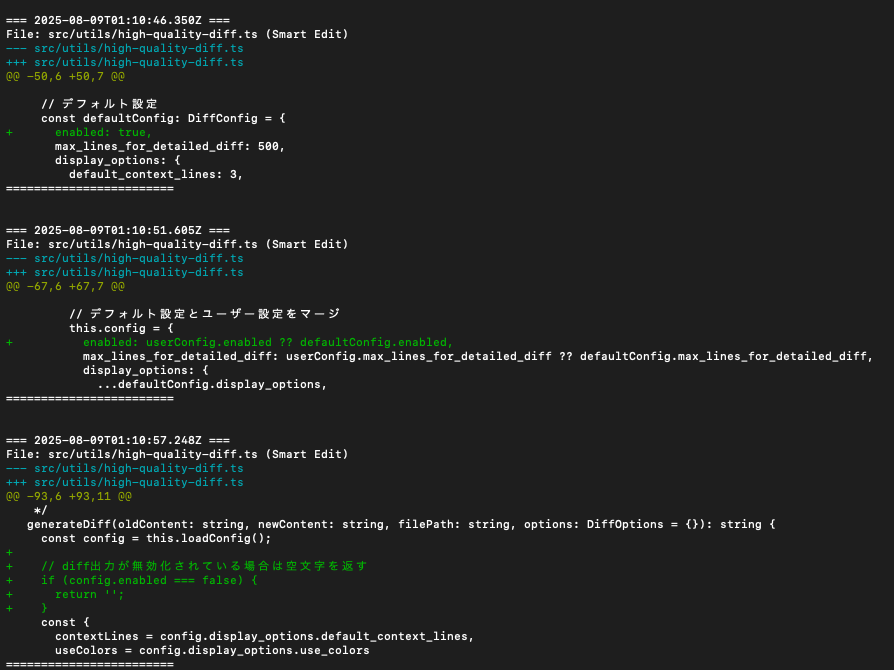

# ログ・Diff設定ガイド

effortlessly-mcpの統合設定システムの詳細な使用方法と設定オプションです。

## 📋 概要

v1.0.6で設定ファイルが統合され、ログとdiff表示を一元管理できるようになりました。

### 主要機能
- **設定ファイル統合**: 全ての設定を1つのYAMLファイルで管理
- **operationsログ制御**: 操作ログの有効/無効切り替え
- **diff表示制御**: diff表示の完全な有効/無効切り替え
- **大規模ファイル判定閾値**: 詳細diff vs サマリー表示の切り替え
- **コンテキスト行数**: diff表示時の前後行数の調整
- **カラーコード常時使用**: ログファイル視認性の向上

## 🔧 統合設定ファイル

### 設定ファイルの場所
```
.claude/workspace/effortlessly/config.yaml
```

### デフォルト設定
```yaml
# effortlessly-mcp 統合設定ファイル
# MCP Server effortlessly-mcp用の設定

# ===== ログ設定 =====
logging:
  # operations ログの有効/無効
  operations:
    enabled: true
  
  # diff ログ・表示設定
  diff:
    # diff出力の有効/無効（false設定で diff出力を完全に無効化）
    enabled: true

    
    # 大規模ファイル判定の閾値（この行数を超えるとサマリー表示）
    max_lines_for_detailed_diff: 500
    
    # diff表示オプション
    display_options:
      # デフォルトコンテキスト行数
      default_context_lines: 3
```

## ⚙️ 設定オプション詳細

### ログ設定 (`logging`)

#### `operations.enabled`
**型**: ブール値  
**デフォルト**: `true`  
**説明**: operationsログの有効/無効を制御します。`false`に設定すると、操作ログの出力が無効化されます。

#### `diff.enabled`
**型**: ブール値  
**デフォルト**: `true`  
**説明**: diff出力の完全な有効/無効を制御します。`false`に設定すると、すべてのdiff出力が無効化されます。

**例**:
```yaml
# diff出力を完全に無効化（パフォーマンス優先）
enabled: false

# diff出力を有効化（デフォルト）
enabled: true
```

### `max_lines_for_detailed_diff`
**型**: 数値  
**デフォルト**: `500`  
**説明**: この行数を超えるファイルに対する変更では、詳細diffの代わりにサマリー表示を使用します。

**例**:
```yaml
# 詳細表示派（大きなファイルも詳細diff表示）
max_lines_for_detailed_diff: 1000

# 軽量表示派（小さなファイルでもサマリー表示）  
max_lines_for_detailed_diff: 100
```

### `display_options.default_context_lines`
**型**: 数値  
**デフォルト**: `3`  
**説明**: diff表示時に変更箇所の前後に表示される行数です。

**例**:
```yaml
display_options:
  default_context_lines: 5  # より多くのコンテキスト表示
```

### `display_options.use_colors`
**型**: ブール値  
**デフォルト**: `false`  
**説明**: diffにANSI色コードを使用するかどうか。Claude Codeでは通常falseを推奨。

**例**:
```yaml
display_options:
  use_colors: true  # ターミナルでの使用時
```

## 📊 diff表示の動作

### 無効化モード（`enabled: false`）
diff出力が完全に無効化されている場合、編集操作は正常に実行されますが、diff出力は一切表示されません。

### 詳細diff表示
ファイル行数が閾値以下の場合、標準的なUnified Diff形式で表示されます：



```diff
--- test.txt
+++ test.txt
@@ -1,3 +1,3 @@
 Line 1
-Line 2
+Line 2 CHANGED  
 Line 3
```

### サマリー表示
ファイル行数が閾値を超える場合、変更概要のサマリーで表示されます：

```
@@ Large change: 600 → 700 lines (README.md)
[Use git diff for detailed view]
```

## 🛠️ 設定例

### 開発チーム向け設定
```yaml
# 詳細な差分を好む開発チーム向け
max_lines_for_detailed_diff: 1000

display_options:
  default_context_lines: 5
  use_colors: false
```

### パフォーマンス重視設定
```yaml  
# 大きなファイルに対してパフォーマンスを重視
max_lines_for_detailed_diff: 200

display_options:
  default_context_lines: 1
  use_colors: false
```

### diff無効化設定
```yaml
# diff出力を完全に無効化してパフォーマンス最大化
enabled: false

# 他の設定は無視される（diff出力自体が無効のため）
max_lines_for_detailed_diff: 500
display_options:
  default_context_lines: 3
  use_colors: false
```

### ターミナル使用設定
```yaml
# ターミナルでの直接使用向け
max_lines_for_detailed_diff: 500

display_options:
  default_context_lines: 3
  use_colors: true
```

## 🔄 設定の適用

### 設定ファイルなしの場合
設定ファイルが存在しない場合、デフォルト値が自動的に使用されます。

### 部分設定
設定ファイルに一部のオプションのみ記載されている場合、記載されていない項目にはデフォルト値が適用されます。

### 設定キャッシュ
設定は1分間メモリにキャッシュされ、ファイルの変更は自動的に反映されます。

## 🧪 設定のテスト

設定が正しく動作しているかテストする方法：

```bash
# 小さなファイルのテスト（詳細diff表示されるべき）
echo -e "Line 1\nLine 2" > test_small.txt
# effortlessly-mcpでファイルを編集

# 大きなファイルのテスト（サマリー表示されるべき）  
seq 1 600 > test_large.txt
# effortlessly-mcpでファイルを編集
```

## ⚠️ 注意事項

1. **Claude Code使用時**: `use_colors: false`を推奨（ANSI色コードが正しく表示されない場合があります）

2. **大規模ファイル**: 非常に大きな閾値（例: 10000）を設定すると、メモリ使用量が増加する可能性があります

3. **YAML形式**: 設定ファイルは有効なYAML形式である必要があります。構文エラーがある場合、デフォルト設定が使用されます

## 🔍 トラブルシューティング

### 設定が反映されない
1. 設定ファイルのパスが正しいか確認
2. YAML構文が正しいか確認
3. ファイルの権限を確認

### diff出力が全く表示されない
1. `enabled: false`が設定されていないか確認
2. 設定ファイルの構文エラーでデフォルト設定が適用されていないか確認

### エラーが発生する
無効な設定値の場合、デフォルト値が使用され、ログにエラーメッセージが記録されます。

## 📚 関連ドキュメント

- [使い方ガイド](USAGE.md)
- [ツールリファレンス](TOOLS.md)
- [トラブルシューティング](TROUBLESHOOTING.md)